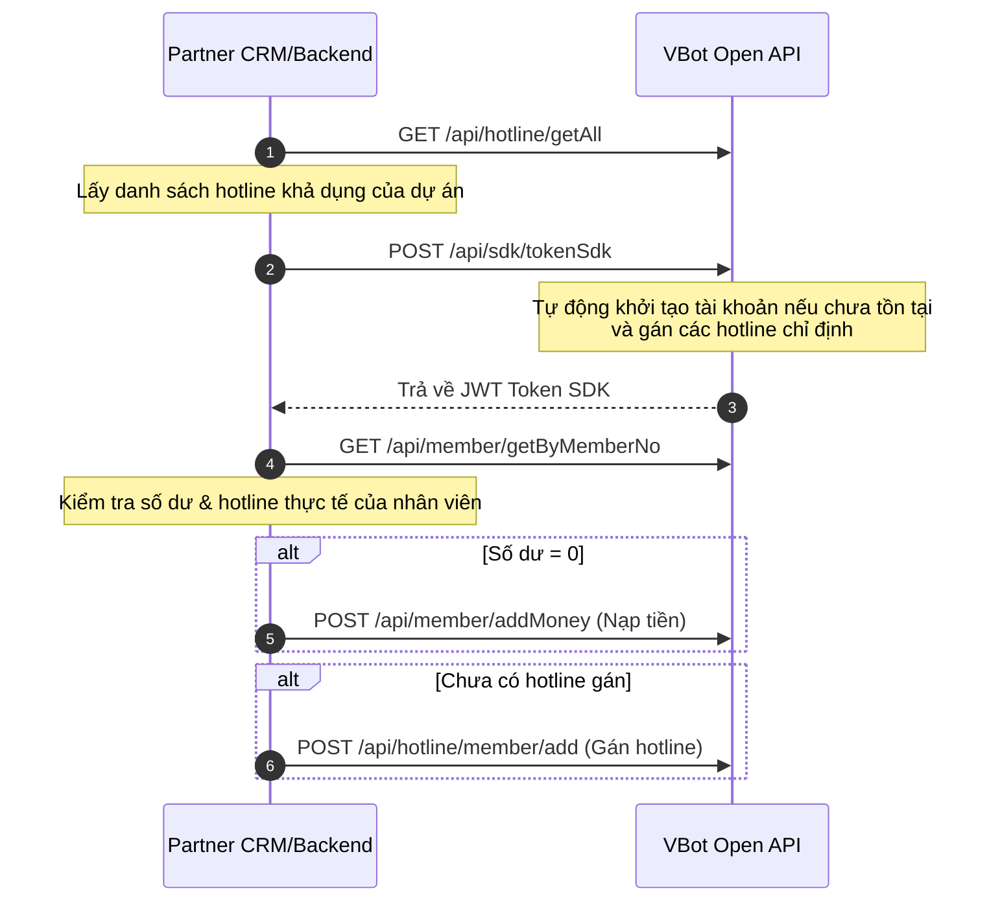

# Hướng dẫn Cấu hình Backend cho Web SDK

Tài liệu này hướng dẫn chi tiết quy trình phát triển và tích hợp ở phía máy chủ (Backend) của Đối tác nhằm chuẩn bị dữ liệu, cấp quyền cuộc gọi, nạp tiền và sinh JWT Token an toàn cho **VBot Web SDK**.

Để thành viên (nhân viên) có thể đăng nhập SDK và thực hiện cuộc gọi thành công, hệ thống của bạn cần phối hợp xử lý một chuỗi API nghiệp vụ VBot dưới đây.

---

## Điều kiện bắt buộc để gọi điện thành công
Hệ thống lõi VBot yêu cầu tài khoản SDK muốn thực hiện cuộc gọi đi phải đáp ứng hai điều kiện:
1. <span class="highlight-text">**Phải được gán ít nhất một Hotline hoạt động**</span>: Nhân viên không thể thực hiện cuộc gọi nếu chưa gán hotline làm đầu số đại diện.
2. <span class="highlight-text">**Tài khoản phải có tiền (Số dư > 0)**</span>: Ngân sách cuộc gọi của nhân viên phải lớn hơn 0đ. Nếu không có số dư, hệ thống sẽ chặn cuộc gọi và báo lỗi `402` (Không đủ tiền).

---

## Quy trình Tích hợp chuẩn trên Backend

Quy trình chuẩn bị dữ liệu và cấp phát tài nguyên cho SDK gồm 4 bước chính:



---

## 1. Tải danh sách Hotline khả dụng

Trước khi thực hiện gán hotline cho nhân viên hoặc cấp token SDK, Backend cần lấy danh sách hotline khả dụng của doanh nghiệp để hiển thị cấu hình hoặc gán chuẩn xác.

<div class="api-container">
  <span class="api-method method-get">GET</span>
  <span>[URL]/api/hotline/getAll</span>
</div>

**Header**

| Tham số | Giá trị |
| :--- | :--- |
| X-API-Key | `Partner_Token_API_Key` |

**Ví dụ Response thành công**

```json
{
  "error": 0,
  "message": "Success",
  "data": [
    {
      "hotline_name": "Hotline Kinh Doanh",
      "hotline_number": "84245559192",
      "hotline_code": "HL_SALES",
      "hotline_type": "HOTLINE"
    },
    {
      "hotline_name": "Hotline Hỗ Trợ Khách Hàng",
      "hotline_number": "84287771234",
      "hotline_code": "HL_SUPPORT",
      "hotline_type": "ALIAS"
    }
  ]
}
```

---

## 2. Cấp phát Token SDK & Tự động tạo Nhân viên

Sử dụng đầu API One-Step Provisioning để lấy mã xác thực JWT SDK cho client.

<div class="api-container">
  <span class="api-method method-post">POST</span>
  <span>[URL]/api/sdk/tokenSdk</span>
</div>

**Header**

| Tham số | Giá trị |
| :--- | :--- |
| X-API-Key | `Partner_Token_API_Key` |

**Body**

| Tham số | Kiểu | Bắt buộc | Mô tả |
| :--- | :--- | :--- | :--- |
| `member_no` | String | Có | Mã định danh duy nhất của nhân viên trên hệ thống của bạn. |
| `hotline_codes` | Array | Không | Danh sách mã hotline cho phép SDK sử dụng (Ví dụ: `["HL_SALES"]`). |

<div class="note">
  <strong>Lưu ý tự động khởi tạo:</strong><br/>
  Nếu mã nhân viên <code>member_no</code> chưa từng tồn tại trên hệ thống VBot, API sẽ tự động khởi tạo một tài khoản SDK mới và liên kết trực tiếp danh sách hotline truyền vào trong tham số <code>hotline_codes</code>. Hãy nhớ gọi API <code>GET /api/hotline/getAll</code> trước đó để lấy danh sách mã hotline chuẩn xác.
</div>

---

## 3. Kiểm tra thông tin Nhân viên

Để kiểm tra xem tài khoản SDK vừa khởi tạo hoặc hiện tại có đủ điều kiện thực hiện cuộc gọi hay chưa, Backend cần truy vấn thông tin chi tiết của nhân viên.

<div class="api-container">
  <span class="api-method method-get">GET</span>
  <span>[URL]/api/member/getByMemberNo</span>
</div>

**Header**

| Tham số | Giá trị |
| :--- | :--- |
| X-API-Key | `Partner_Token_API_Key` |

**Tham số truy vấn (Query String)**

| Tham số | Kiểu | Bắt buộc | Mô tả |
| :--- | :--- | :--- | :--- |
| `member_no` | String | Có | Mã định danh duy nhất của nhân viên cần kiểm tra. |

**Ví dụ Response thành công**

```json
{
  "error": 0,
  "message": "success",
  "data": {
    "member_name": "Nguyễn Văn A",
    "member_ext_number": 102,
    "member_no": "agent_001",
    "member_status": 1,
    "member_money": 0.0,
    "expiration_date": "2026-12-31T23:59:59Z"
  }
}
```

---

## 4. Kiểm tra điều kiện & Cấu hình tự động (JIT Provisioning)

Dựa vào thông tin trả về từ **Bước 3**, Backend tiến hành so khớp các điều kiện cuộc gọi để thực hiện cấu hình tự động:

### A. Nếu số dư bằng 0 (`member_money == 0`)
Thực hiện cuộc gọi API nạp tiền để cấp ngân sách gọi điện ban đầu cho nhân viên:

<div class="api-container">
  <span class="api-method method-post">POST</span>
  <span>[URL]/api/member/addMoney</span>
</div>

**Body**

```json
{
  "member_no": "agent_001",
  "money": 1000 // Số tiền nạp mặc định (VND)
}
```

### B. Nếu hotline chưa được gán cho thành viên
Trong trường hợp danh sách hotline được cấp cho nhân viên bị thiếu (chưa được gán hotline nào để sử dụng làm đầu số gọi đi), gọi API gán hotline cho thành viên:

<div class="api-container">
  <span class="api-method method-post">POST</span>
  <span>[URL]/api/hotline/member/add</span>
</div>

**Body**

```json
{
  "member_no": "agent_001",
  "hotline_number": "84245559192", // Số hotline (lấy từ trường hotline_number ở Bước 1)
  "allow_call": true,
  "start_time": "",
  "end_time": ""
}
```

---

## Mã mẫu minh hoạ luồng xử lý trên Backend (Node.js)

Dưới đây là đoạn mã Node.js minh hoạ toàn bộ quy trình trên:

```javascript
const axios = require('axios');

const VBOT_BASE_URL = 'https://open-api.vbot.vn/v3.0';
const PARTNER_API_KEY = 'your_partner_api_key';

async function provisionMemberSdk(memberNo, targetHotlineCode) {
  const headers = {
    'X-API-Key': PARTNER_API_KEY,
    'Content-Type': 'application/json'
  };

  try {
    // 1. Tải danh sách hotline để tìm thông tin số điện thoại tương ứng
    const hotlineRes = await axios.get(`${VBOT_BASE_URL}/api/hotline/getAll`, { headers });
    const hotlines = hotlineRes.data.data || [];
    const matchedHotline = hotlines.find(h => h.hotline_code === targetHotlineCode);
    
    if (!matchedHotline) {
      throw new Error(`Không tìm thấy hotline với mã ${targetHotlineCode}`);
    }

    // 2. Lấy SDK Token (và tự động tạo nhân viên mới nếu chưa có)
    const tokenRes = await axios.post(`${VBOT_BASE_URL}/api/sdk/tokenSdk`, {
      member_no: memberNo,
      hotline_codes: [targetHotlineCode]
    }, { headers });
    
    const sdkToken = tokenRes.data.data;
    console.log('Sinh SDK Token thành công:', sdkToken);

    // 3. Truy vấn thông tin nhân viên để kiểm tra số dư và hotline
    const memberRes = await axios.get(
      `${VBOT_BASE_URL}/api/member/getByMemberNo?member_no=${memberNo}`, 
      { headers }
    );
    const memberInfo = memberRes.data.data;

    if (memberInfo) {
      // 4.1. Nạp tiền nếu số dư bằng 0
      if ((memberInfo.member_money || 0) <= 0) {
        console.log('Số dư bằng 0, đang tự động nạp tiền...');
        await axios.post(`${VBOT_BASE_URL}/api/member/addMoney`, {
          member_no: memberNo,
          money: 1000 // Nạp trước 1,000đ
        }, { headers });
      }

      // 4.2. Gán hotline bằng API add nếu nhân viên chưa được gán số nào
      const currentHotlines = memberInfo.hotlines || memberInfo.hotline_numbers || [];
      if (currentHotlines.length === 0) {
        console.log('Chưa được gán hotline, đang tự động gán...');
        await axios.post(`${VBOT_BASE_URL}/api/hotline/member/add`, {
          member_no: memberNo,
          hotline_number: matchedHotline.hotline_number,
          allow_call: true,
          start_time: '',
          end_time: ''
        }, { headers });
      }
    }

    return {
      token: sdkToken,
      member: memberNo
    };

  } catch (error) {
    console.error('Lỗi khi thiết lập tài khoản SDK nhân viên:', error.response?.data || error.message);
    throw error;
  }
}
```
